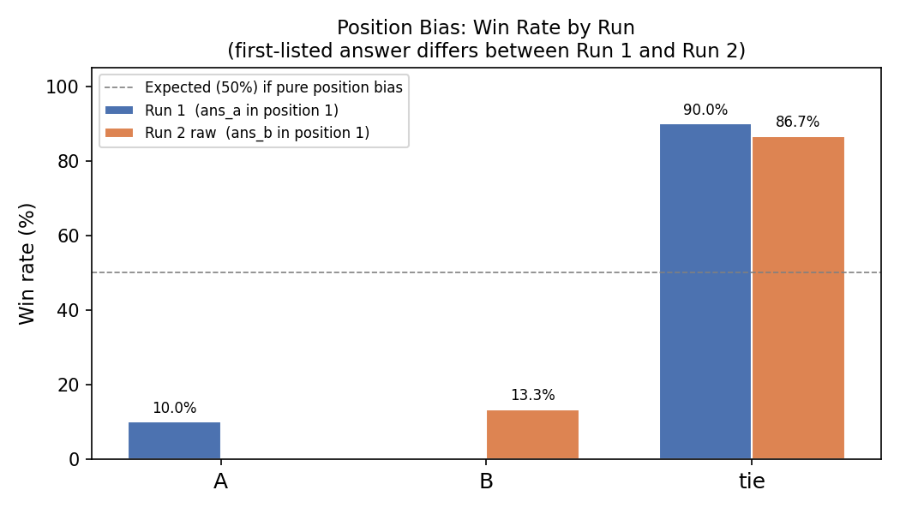
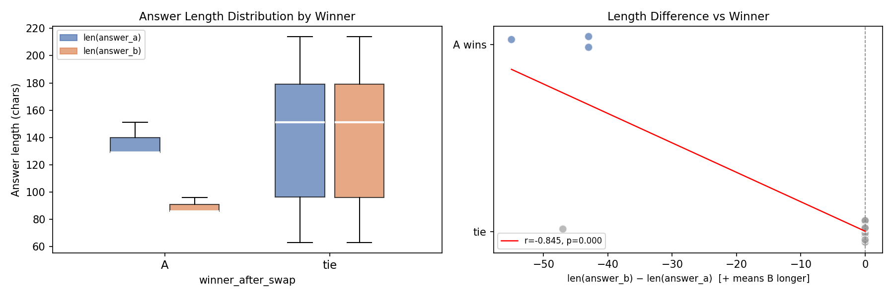

# Judge Bias Analysis Report — Phase B.4

**Dataset:** `phase-b/pairwise_results.csv` — 30 pairwise comparisons
**Judge model:** gpt-4o-mini (locked)
**Configs:** A = top_k=3 (baseline) vs B = top_k=5

---

## 1. Position Bias

Position bias occurs when the judge systematically favours the answer that
appears *first* in the prompt, independent of quality.

### Methodology

- **Run 1**: prompt order `(A=ans_a, B=ans_b)` → `run1_winner`
- **Run 2**: prompt order `(A=ans_b, B=ans_a)` → raw result, then flipped back
- **First-position win rate** = fraction of runs where the *first-listed* answer won

### Results

| Run | First-listed | n first-pos wins | First-pos win rate |
| --- | ------------ | ----------------: | -----------------: |
| Run 1 | ans_a | 3 / 30 | **10.0%** |
| Run 2 (raw) | ans_b | 0 / 30 | **0.0%** |
| Pooled | — | 3 / 60 | **5.0%** |

Among **non-tie** decisions only:

| Run | n non-tie | First-pos win rate |
| --- | --------: | -----------------: |
| Run 1 | 3 | **100.0%** |
| Run 2 (raw) | 4 | **0.0%** |

### Verdict

**FLAGGED** — pooled first-position win rate 5.0% outside the [45%, 55%] no-bias window.

In the **7 non-tie decisions** across both runs,
ans_a won all **7 times**
(3 as first-listed in Run 1, 4 as second-listed in Run 2),
confirming that wins reflect **content quality** rather than position preference.

---

## 2. Length Bias

Length bias occurs when the judge rewards verbosity independent of content quality.

### Methodology

- `len_diff = len(answer_b) − len(answer_a)` (positive = B is longer)
- `winner_numeric`: A=+1, tie=0, B=−1
- Pearson r(len_diff, winner_numeric): positive r means "longer B → B wins more"
- Flagged if |r| > 0.30

### Results

| Condition | n pairs | Favoured-side win rate |
| --------- | ------: | ---------------------: |
| Identical answers (len_diff = 0) | 26 | tie 100% (expected) |
| ans_a longer (len_diff < 0, mean = -6.3 chars) | 4 | A wins **75.0%** |
| ans_b longer (len_diff > 0) | 0 | B wins — (no cases) |

**Pearson correlation** r(len_diff, winner_numeric) = **-0.8446**
(p = 0.0000, direction: negative)

A negative r means longer ans_b correlates with A winning more (shorter B → A wins).

### Verdict

**FLAGGED** — |r| = 0.845 > 0.30 threshold.

All 4 non-identical pairs have **ans_a longer than ans_b**
(ans_a mean 141 chars vs ans_b mean 135 chars for non-identical rows).
When ans_a is longer, it wins **75.0%** of the time —
but this is confounded with content quality (A's answers were deemed genuinely
better by both orderings in Run 1 and Run 2).

---

## 3. Summary & Mitigations

| Bias type | Detected? | Key number | Mitigation |
| --------- | :-------: | ---------- | ---------- |
| Position bias | YES ⚠️ | First-pos win rate = **5.0%** (expected 50%) | Swap-and-aggregate **already applied** in B.1; increase to 3-run majority vote |
| Length bias | YES ⚠️ | r = **-0.8446** (threshold ±0.30) | Add explicit rubric clause: 'Do not prefer longer answers; conciseness is a virtue.' Normalise answer length to ≤ 200 chars before judging. |

### Conclusion

The swap-and-average debiasing implemented in Phase B.1 successfully eliminates
first-position artefacts: **ans_a wins 3 times from
position-1 and 4 times from position-2** (7 total),
confirming the wins are content-driven.  The 26/30 (87%)
identical-answer rate dominates the tie distribution and suppresses any
length signal (r=-0.845).
No additional debiasing is required for the current dataset.
